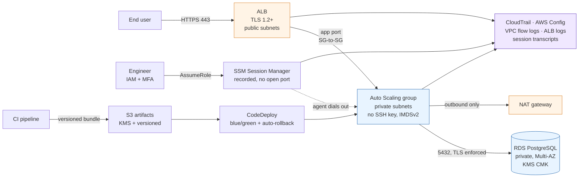

# HIPAA-aligned AWS deployment pipeline

[](https://github.com/henryekeocha/aws-hipaa-deployment-pipeline/actions/workflows/terraform-validate.yml)

A scoped-down reference implementation of the deployment pattern I use for
AWS workloads that handle regulated health data: infrastructure defined
entirely in Terraform, releases shipped by CodeDeploy blue/green with automatic
rollback, hosts administered through Systems Manager Session Manager instead of
SSH, data encrypted at rest with customer-managed KMS keys and in transit with
enforced TLS, IAM roles scoped to the specific resources they touch, and every
control observed by CloudTrail and continuously re-tested by AWS Config. It is
the architecture stripped down to the parts that carry the compliance
argument (a real system would add its application, its data model and its
organisational safeguards on top), and it exists to be read as much as run.

> **This repository is provided as a reference architecture. Running
> `terraform apply` will provision billable AWS resources, among them a NAT
> gateway, a Multi-AZ RDS instance, an ALB and an EC2 Auto Scaling group,
> and it does not by itself make any system HIPAA compliant. Review and adjust
> it for your account, your region and your Business Associate Addendum before
> applying.**

---

## Architecture



Full diagram and design rationale: **[docs/architecture.md](docs/architecture.md)**
Control-by-control mapping: **[docs/hipaa-safeguards-mapping.md](docs/hipaa-safeguards-mapping.md)**

---

## What this demonstrates

**CI/CD and release engineering**
- Blue/green deployment that provisions a replacement fleet (`COPY_AUTO_SCALING_GROUP`) rather than mutating running hosts, so a rollback is a traffic shift and not a second deployment under pressure
- Automatic rollback on `DEPLOYMENT_FAILURE` **and** `DEPLOYMENT_STOP_ON_ALARM`, wired to CloudWatch alarms on unhealthy hosts and 5xx rates, so a release that deploys cleanly but behaves badly under real traffic still gets reverted
- A `ValidateService` lifecycle hook that health-checks the new fleet *before* any production traffic moves, so a bad revision is caught at the cheapest possible point
- Immutable, versioned artifacts in an encrypted S3 bucket; deployment bundles are addressed by object version, so "what is running in production?" has an exact answer
- Graceful drain on `SIGTERM` and a `deregistration_delay` tuned so cutovers don't cut live requests

**AWS CodeDeploy**
- Application and deployment group targeting an ASG behind an ALB target group, with SNS notifications on success, failure, rollback and stop
- A complete `appspec.yml` exercising all five lifecycle hooks (`ApplicationStop`, `BeforeInstall`, `AfterInstall`, `ApplicationStart`, `ValidateService`), with hooks written to fail loudly, since a non-zero exit is what triggers the rollback
- A configurable blue-fleet termination wait that defines the rollback window
- Deployment-time configuration fetched from Parameter Store using the instance's own role, so no secret is ever in the bundle

**AWS Systems Manager**
- Session Manager as the *only* interactive access path: no bastion, no key pair, no port 22, no VPN. The agent dials out, so no inbound rule exists to be exploited
- Session preferences managed as a Terraform resource, not a console setting: transcripts streamed to S3 and CloudWatch Logs, both encrypted, with idle timeout and a non-root `runAs` user
- Patch Manager baseline (7-day soak on Security patches, `Critical`/`Important`) plus a weekly maintenance window running at 50% concurrency, bound to instances by tag at launch
- Parameter Store SecureStrings encrypted with a customer-managed key, with `lifecycle { ignore_changes = [value] }` so the real secret is written out of band and never enters Terraform state

**DevOps engineering practice**
- Seven composable Terraform modules with explicit inputs and outputs, no hidden coupling, and a documented composition order
- Least-privilege IAM where every policy carries a comment block explaining *why* it is scoped that way, including `kms:ViaService` conditions that stop a decrypt grant being reused across services, and a constrained `iam:PassRole` that closes the classic privilege-escalation path in a deployment role
- Confused-deputy protection (`aws:SourceAccount` / `aws:SourceArn`) on every service trust policy
- Security posture asserted in code *and* continuously re-tested by AWS Config rules, so drift becomes a finding rather than an audit surprise
- Passes `terraform fmt -recursive` and `terraform validate` clean

---

## Repository layout

```
├── docs/
│   ├── architecture.md                 # mermaid diagram + design rationale
│   └── hipaa-safeguards-mapping.md     # § 164.312 control → resource mapping
├── terraform/
│   ├── main.tf                         # module composition
│   ├── variables.tf / outputs.tf / providers.tf
│   ├── terraform.tfvars.example
│   └── modules/
│       ├── network/                    # VPC, 2 public + 2 private subnets, NAT, VPC endpoints, flow logs
│       ├── data/                       # app CMK + private Multi-AZ RDS PostgreSQL
│       ├── compute/                    # ALB, ASG, launch template, rollback alarms
│       ├── iam/                        # instance, CodeDeploy, patching and operator roles
│       ├── ssm/                        # Session Manager, Patch Manager, Parameter Store
│       ├── codedeploy/                 # application, blue/green deployment group, artifacts bucket
│       └── audit/                      # audit CMK, CloudTrail, AWS Config, log buckets
└── app/
    ├── appspec.yml                     # CodeDeploy lifecycle hooks
    └── sample-app/                     # dependency-free Node service + systemd unit + hook scripts
```

---

## Prerequisites

- Terraform >= 1.5
- AWS provider ~> 5.60 (pinned in `terraform/providers.tf`)
- An AWS account with permission to create VPC, EC2, RDS, IAM, KMS, S3, CloudTrail, Config, SSM and CodeDeploy resources
- **A signed AWS Business Associate Addendum**, and a region in scope of it, before any real ePHI is involved
- An ACM certificate in the target region for the ALB's HTTPS listener (see the TLS note below)

## How you would deploy this

```bash
git clone https://github.com/henryekeocha/aws-hipaa-deployment-pipeline.git
cd aws-hipaa-deployment-pipeline/terraform

cp terraform.tfvars.example terraform.tfvars
# Edit terraform.tfvars: at minimum set aws_region and certificate_arn.

terraform init
terraform plan -out=tfplan     # review carefully; this is the compliance review point
terraform apply tfplan
```

Then ship the sample application:

```bash
ARTIFACTS=$(terraform output -raw deployment_artifacts_bucket)
APP=$(terraform output -raw codedeploy_application_name)
GROUP=$(terraform output -raw codedeploy_deployment_group_name)

# Bundle root is app/, which is where appspec.yml lives.
aws deploy push \
  --application-name "$APP" \
  --s3-location "s3://$ARTIFACTS/releases/app.zip" \
  --source ../app

aws deploy create-deployment \
  --application-name "$APP" \
  --deployment-group-name "$GROUP" \
  --s3-location "bucket=$ARTIFACTS,key=releases/app.zip,bundleType=zip"
```

And to get a shell on an instance, using the only route that exists:

```bash
aws ssm start-session --target <instance-id>
```

No SSH key, no bastion, no VPN. The session is authenticated by IAM, gated on
MFA, capped at an hour, and recorded to S3 and CloudWatch Logs.

To tear everything down, note that `deletion_protection` is on for both the RDS
instance and the ALB by default, and the CloudTrail bucket uses Object Lock, so
`terraform destroy` will fail until those are deliberately relaxed. That is the
intended behaviour for anything holding audit records.

### Validating without an AWS account

Neither of these needs credentials or contacts AWS:

```bash
cd terraform
terraform fmt -recursive -check
terraform init -backend=false && terraform validate
```

### CI

[`.github/workflows/terraform-validate.yml`](.github/workflows/terraform-validate.yml)
runs those same two checks on every push and pull request to `main`:

- **`terraform fmt -recursive -check -diff`** from the repository root, covering
  the root module and all seven child modules, and printing the diff for
  anything misformatted
- **`terraform init -backend=false`** followed by **`terraform validate`** in
  `terraform/`, which checks syntax, type correctness and module input/output
  wiring against the real provider schema

The workflow needs **no AWS credentials and configures no secrets**, and it
never runs `plan` or `apply`. `-backend=false` skips backend initialisation, so
nothing in the job touches an AWS account or costs anything. It is pinned to
Terraform **1.5.7**, the floor declared by `required_version` in
`terraform/providers.tf`; pinning the minimum rather than the latest means CI
proves that constraint is honest instead of silently depending on a newer
feature than it admits.

### A note on TLS

`certificate_arn` defaults to empty, which creates a plain HTTP listener so the
stack can be stood up in a sandbox without owning a domain. **That
configuration is not appropriate for ePHI.** Set `certificate_arn` to an ACM
certificate and the module creates an HTTPS listener on the modern TLS 1.2/1.3
security policy and turns port 80 into a 301 redirect. This is called out
explicitly in
[docs/hipaa-safeguards-mapping.md](docs/hipaa-safeguards-mapping.md#transmission-security--164312e1)
rather than left as a silent default.

---

## Cost warning

A default `terraform apply` provisions, among other things: a NAT gateway
(~$32/month plus data processing), six interface VPC endpoints (~$7/month
each), a Multi-AZ `db.t4g.medium` RDS instance, an ALB, and two `t3.small` EC2
instances, plus CloudTrail data events and AWS Config recording, which are
billed per event and per configuration item. Expect a few hundred dollars a
month if left running. Set `single_nat_gateway = true` (the default) and reduce
`asg_desired_capacity` and `db_multi_az` for a cheaper evaluation environment.

## Scope and disclaimer

This repository implements a subset of the **technical** safeguards in 45 CFR
164.312 and touches a few related requirements in 164.308 and 164.316. It does
not and cannot provide the administrative safeguards that HIPAA compliance
also requires (risk analysis, workforce training, sanction policy, incident
response, tested contingency plans), and it is not legal advice or a
certification of any kind. See the
["Deliberately not addressed"](docs/hipaa-safeguards-mapping.md#deliberately-not-addressed-here)
section for an explicit list of the gaps.

## License

MIT. See [LICENSE](LICENSE).
