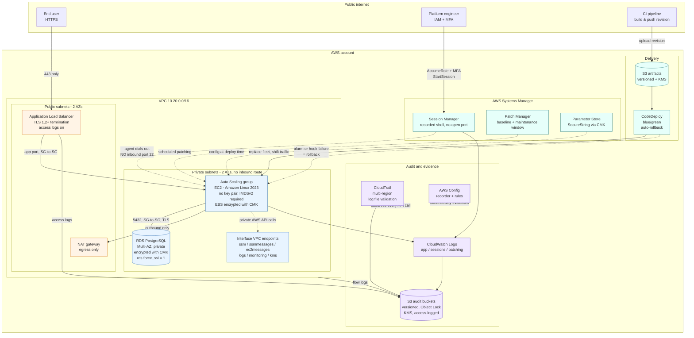

# Architecture

## Diagram

## The three paths

There are exactly three ways anything reaches a running instance, and each one
is a deliberate design choice.

**User traffic** enters at the load balancer, which is the only resource in the
account with a public address. It terminates TLS 1.2 or 1.3 and forwards to
instances that hold no public IP and sit in subnets whose route tables contain
no path to an internet gateway. The security group on those instances has a
single ingress rule, and it references the load balancer's security group
rather than a CIDR range — so membership of that group, not an IP address that
some other workload could later inherit, is what grants reachability. The same
pattern repeats one tier down: the database accepts connections only from the
application security group, and has no egress rules at all, because a database
has no legitimate reason to originate a connection.

**Administrative access** goes through Systems Manager Session Manager, and
that is the entire story — there is no bastion host, no key pair, no port 22
rule and no VPN. The SSM agent on each instance dials outbound to the Systems
Manager endpoints (which, thanks to the interface VPC endpoints, never leaves
the AWS network), so a shell requires no inbound connectivity whatsoever. What
replaces SSH keys is IAM: an engineer assumes a role that can only be assumed
with an MFA credential presented in the last hour, that expires after an hour,
and that can only open a session against instances carrying a specific tag.
Port-forwarding session documents are explicitly denied, which closes the
obvious hole — otherwise an operator could tunnel the private database port to a
laptop and read ePHI through a channel the session transcript would not
capture. Every keystroke and every byte of output is streamed to both S3 and
CloudWatch Logs, encrypted, and the instance role that writes those transcripts
has `s3:PutObject` and nothing else: an operator cannot read back or delete the
recording of what they just did.

**Code** reaches an instance only through CodeDeploy. Because there is no SSH,
this is not a convention that a hurried engineer can bypass at 2am — it is the
only mechanism that exists. A release is a versioned, immutable bundle in an
encrypted S3 bucket, applied by an agent, gated by a `ValidateService` hook
that curls the health endpoint on the new fleet before any production traffic
moves, and reversible: blue/green provisions a brand-new fleet rather than
mutating running hosts, keeps the previous fleet alive for a configurable
rollback window, and rolls back automatically if a lifecycle hook fails or if
the unhealthy-host or 5xx alarms fire under real traffic.

## Why blue/green rather than in-place

In-place deployment mutates a running host, which makes two things hard that
matter here. First, rollback becomes a second deployment — you are re-running
the same fragile step under pressure, and it takes as long as the original.
Blue/green makes rollback a traffic shift onto a fleet that is still running,
measured in seconds. Second, an in-place deployment leaves a host whose state
is the accumulated result of every release it has seen, which is difficult to
attest to. Under blue/green, every instance serving traffic was built from a
known AMI plus exactly one bundle, so "what is running in production?" has a
precise answer — which is the same property that makes the configuration
auditable.

## Where the encryption boundaries are

Two customer-managed KMS keys, not one, and not the AWS-managed defaults. The
application key protects the database, EBS root volumes, SecureString
parameters and application log groups. The audit key protects CloudTrail, AWS
Config and the audit log groups. Splitting them means an attacker who obtains
application-key access still cannot decrypt the audit trail that records what
they did — key custody for the evidence is separate from key custody for the
records.

Choosing customer-managed keys over the AWS-managed defaults is what makes
encryption an *auditable* control rather than just a checkbox: the key policy
is ours and enumerates exactly which principals may decrypt, every
`Decrypt`/`GenerateDataKey` call appears in CloudTrail with the calling
principal, rotation is provable, and disabling the key is a containment lever
that cryptographically cuts off access to the data. The IAM policies stack a
second boundary on top with `kms:ViaService` conditions, so the instance role's
`kms:Decrypt` grant works only for calls arriving through Systems Manager (for
config) or S3 (for deployment bundles) — the same grant cannot be reused to
read an encrypted snapshot.

In transit, the load balancer enforces TLS 1.2+ with the modern ELB security
policy and redirects port 80, the database rejects non-TLS connections at the
engine via `rds.force_ssl`, every S3 bucket in the stack carries a bucket
policy that denies requests where `aws:SecureTransport` is false, and internal
AWS API traffic from the private subnets stays on the AWS network through
interface endpoints rather than transiting the NAT gateway.

## What observes all of it

CloudTrail answers "what happened?" — multi-region, including global service
events, with log file validation enabled so `aws cloudtrail validate-logs` can
prove after the fact that no record was altered or removed. Its bucket is
versioned, Object Lock is on in GOVERNANCE mode, and its own reads are logged
to a separate bucket.

AWS Config answers the different question of "what is the configuration right
now, and does it still comply?" The recorder is paired with a set of managed
rules chosen specifically to re-test the claims this repository makes elsewhere
— IMDSv2 enforcement, encrypted volumes, no public RDS, no open SSH, blocked
public S3 access, patch compliance. If someone loosens a security group by hand
next quarter, that shows up as a `NON_COMPLIANT` finding rather than as a
surprise during an audit.

Underneath both, VPC flow logs capture accepted and rejected connections at the
network level, ALB access logs capture every request, and CloudWatch Logs holds
application, session and patching output — all with retention set explicitly
rather than left at the default.

## What this repository is not

It is a reference pattern, not a compliance product. Nothing in it constitutes a
HIPAA certification, and no AWS configuration can: HIPAA compliance is a
property of an organisation's administrative, physical and technical safeguards
together, of which this covers a subset of the technical ones. Before any of
this handles real ePHI you need a signed Business Associate Addendum with AWS,
use restricted to
[HIPAA-eligible services](https://aws.amazon.com/compliance/hipaa-eligible-services-reference/)
in a region in scope of that BAA, and the administrative safeguards — workforce
training, sanction policy, incident response procedures, risk analysis — that
this repository cannot express in Terraform. See
[hipaa-safeguards-mapping.md](hipaa-safeguards-mapping.md) for what is and is
not addressed here.
